# Desafio DevOps Pro


This git repository centralizes the study of the material provided by Fabricio Veronez for the **DevOps & Cloud Challenge** that happened from Jan 13th to the 17th in 2025, mixed with my personal notes, observations and general tomfoolery. It concerns the practice of the following technologies:

<br>

<table align="center" style="border-collapse: collapse;">
  <tr>
    <td align="center" style="border: none;">
      
      <br>Docker
    </td>
    <td align="center" style="border: none;">
      
      <br>Kubernetes
    </td>
    <td align="center" style="border: none;">
      
      <br>AWS
    </td>
    <td align="center" style="border: none;">
      
      <br>GitHub Actions
    </td>
    <td align="center" style="border: none;">
      
      <br>Prometheus
    </td>
    <td align="center" style="border: none;">
      
      <br>Grafana
    </td>
    <td align="center" style="border: none;">
      
      <br>NGINX
    </td>
  </tr>
</table>


<br>
        
Namely, the purpose is to provide an e-commerce solution for the continuous delivery of an online store app built on Python and containerized through Docker. Their inventory will be built as a PostgreSQL database. The application will be run on a Kubernetes cluster and will be monitored through Prometheus, while exhibiting relevant information on Grafana. We'll host the application on an AWS EC2 instance and automate the delivery process through CI/CD pipelines provided by the GitHub Actions platform.

<div align="center">

# $\color{goldenrod}{\textrm{Day 1 - Docker}}$

</div>

<div align="center">

## $\color{goldenrod}{\textrm{1.1 - Intro}}$

</div>

DevOps aims to automate tasks and standardize processes involved in the application development lifecycle. This is where containers are helpful, since they allow the execution of processes in isolated fashion, avoiding conflict between them, solving the "_but it works on my machine_" conundrum. It ensures the application runs the same way regardless of the environment or OS. In a nutshell, it enforces isolation, portability, initialization speed and consistency in the app behavior. Docker is by far the most adopted container solution, and the one we'll use here.

Docker architecture is divided in 3 elements:
- **The Daemon**, which manages and handles the control of images, containers, networks and volumes;
- **The Client**, which interacts with the Daemon through CLI, allowing the execution of commands such as `docker run`, `docker pull`, etc; 
- **The Registry**, which is the image repository. DockerHub is the official registry.

We interface with Docker through either **Docker Desktop** (a handy GUI with additional resources and extensions, but heavier, with slower perfomance) or **Docker Engine**. I'm personally using the Engine in Ubuntu 24.04 through WSL2.

The overall usage, commands and functionalities of Docker are covered in another (private, for now) repository, `Docker Study`.

Our e-commerce application webpage will be hosted through **NGINX**: `docker container run -d nginx`; I can access this container by using `docker container exec -it <container_id> /bin/bash` and test it by inserting `curl http://localhost` (notice that we're now inside the container CLI, in interactive mode, thanks to the `it` tag), which displays a message confirming that NGINX is running fine.

But in order to access NGINX properly we should set the port binding, where we will route the 80 port from the container to our host machine local port (8080): `docker container run -d -p 8080:80 nginx`.

Now, the PORTS section for this container will exhibit `0.0.0.0:8080->80/tcp` i.e. we have _published the port 80 of the container to the 8080 port on the host (my machine)_, so any requests sent to http://localhost:8080 on my host are forwarded to port 80 of the NGINX server running inside the container. If we open a browser and access `localhost:8080`, we'll see the "welcome to NGINX" webpage.

To stop, we use `docker container stop <container-id>`; we can now remove this container with `docker container rm <container-id>` if we want to do so. 

>__TIP__ Suppose you have a bunch of containers running. `docker conteiner ls -aq` lists all of the containers id's, which is handy since now I can combine it with the rm -f command to remove all of them at once: `docker container rm -f $(docker containers ls -aq)`

---

<div align="center">

## $\color{goldenrod}{\textrm{1.2 - Dockerfile}}$
</div>

Let's run a python-based example project that converts distances. For creating the DOckerFile, we need a python base image, the code itself and any dependencies (and pip, to deal with them). Namely, we`ll use:


```
click==8.0.1
Flask==2.0.1
gunicorn==20.1.0
itsdangerous==2.0.1
Jinja2==3.0.1
MarkupSafe==2.0.1
Werkzeug==2.0.1
```

Since this combination is common for lightweight, scalable web services. We _could_ just use Flask, but its built-in development server is designed for development purposes only. While it's great for testing and debugging during development, it lacks the robustness, performance, and features needed for production environments. Gunicorn (or a similar WSGI server) is typically used for production because it offers better performance, stability, security, scalability and integration. It also has better log handling and debugging capabilities.

So far our folder contains:
- a template subfolder with the index.html file
- the app.py file
- the requirements.txt file

Time to containerize! We now create the Dockerfile:

```
FROM python:3.13.0

WORKDIR /app
COPY requirements.txt .
RUN pip install -r requirements.txt
COPY . /app
EXPOSE 5000
CMD ["gunicorn", "--bind", "0.0.0.0:5000", "app:app"]
```

- It is based on a python image (since that's the core of the app). Remember to always define the tag i.e. the version you're using.
- The `WORKDIR` creates (and enters) an app folder, as if I were to run mkdir + cd.
- With the base image and the folder structure all set, we need to download the project dependencies with pip. Pip needs the requirements.txt, so we need to copy this file to the /app directory! Since we've already "cd"ed into the /app folder, we copy requirements.txt into ".", the current directory. We can simply state requirements.txt because that file is on the same level as the DockerFile. _One ought to be careful with these details, lest one breaks the entire application like a fool of a Took_.
- The `RUN` command tells ~~Pippin~~ pip to install the requirements. The "-r" indicates that the input is a requirements file, not a single package name.
- The `COPY . /app` transfers all of my local files to the container, so it's readily available. I could also write `COPY . .`
- The `EXPOSE 5000` declares that I'm using the port 5000 in the container.
- `CMD ["gunicorn, "--bind", "0.0.0.0:5000", "app:app"]` is only run when the container initializes, _not during the creation of the image, like the previous commands_. Whenever I create a container, I need to specify the initialization commands. `0.0.0.0:5000` states that anyone can perform requisitions to the 5000 port.

Finally, I can cd into the directory with the Dockerfile and run it with

`docker build -t distance-conversion -f Dockerfile .`

- -t is a tag to specify the name of the image;
- -f specifies the file that I'm using to create the image;
- . specifies the context i.e. which is the local directory in my machine that will be sent to the Docker Daemon so it can create the image.

it was successfully created! So now we can run the container with `docker container run -d -p 8181:5000 distance-conversion`, check that it's running with `docker ps` and see the application running on the brower with localhost:8181

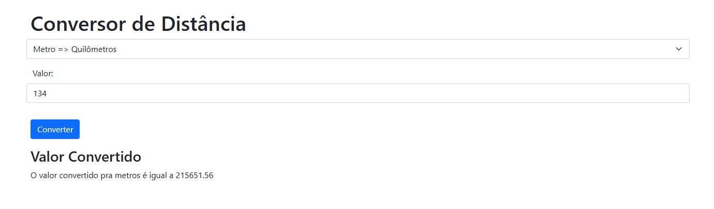

---
<div align="center">

## $\color{goldenrod}{\textrm{1.3 - Docker Registry and DockerHub}}$

</div>

We'll store our public images in DockerHub, the oficial registry from Docker. This service is free for public images, but we can purchase secure storage for private images if needed.

To upload our image to DockerHub, we must follow some standard notation: namespace/repository:tag e.g. hbatistuzzo/distance-conversion:v1

We'll rerun the building with `docker build -t hbatistuzzo/distance-conversion:v1 .`

To push the image to DockerHub, we also need to authentice our login, so `docker login`, input credentials, and then use `docker push hbatistuzzo/distance-conversion:v1`

Since this is the latest version, it's also a good practice to label it as such. Just use `docker tag hbatistuzzo/distance-conversion:v1 hbatistuzzo/distance-conversion:latest`, and then push that with `docker push hbatistuzzo/distance-conversion:latest`

---

<div align="center">

# $\color{goldenrod}{\textrm{Day 2 - Kubernetes}}$

## $\color{goldenrod}{\textrm{2.1 - Intro}}$

</div>

Kubernetes is the most widely used container orchestrator available today. It's a particularly good combo with Docker, allowing both **environment stardardization** and **managing update deploys of applications in production phase without the risk of downtime**.

Docker alone handles projects of small complexity, but an orchestrator becomes essential once the focus shifts to **scalability, resilience and 24/7 availability**. In these cases it becomes necessary to manage load balancing, for example.

It works with a cluster architecture, being composed of 2 main parts:
- **The Control Plane**, which includes the: 
  - API Server: main communication service with Kubernets;
  - etcd: a key-value database that stores the cluster info;
  - scheduler: which defines which containers will be run in which nodes;
  - the controller manager: that manages the desired state of the cluster.
- **Worker Nodes**, which includes the:
  - kubelet: responsible for ensuring that containers are running, by communicating with the runtime container;
  - kube-proxy: that manages the network communication in the cluster.

There are a few ways of creating Kubernetes' clusters.
  - **_on premise_**: the more complex way, you're responsible for managing the cluster creation yourself: linux installation, updating, cluster configuration and applications. Not recommended for beginners.
  - **_as a service_**: which uses tools managed by the main cloud providers (e.g. EKS, AKS, GKE); here, you simply request the cluster creation and it is provided to you as a black box.
  - **local environment**: the didactic, proof of concept approach, using tools such as Minikube, Kind or K3d, which create the cluster based on Docker containers i.e. every cluster machine will be a container on the local machine.

Let's take our first steps by using the light K3d approach. Containers will simulate the nodes in the cluster. We first install kubectl and k3d following the respective instructions (I'm doing it on my ubuntu machine through WSL2). Now we're done to dive in:


<div align="center">

## $\color{goldenrod}{\textrm{2.2 - Creating a cluster}}$

</div>

A default, single-node cluster can be created with `k3d cluster create`. This node executes all of the functions that are usually divided into each of the components of the Control Plane and the Worker Nodes.

We can visualize the nodes with `kubectl get nodes`, which lists a single node with the roles "control_plane" and "master". I can also see the clusters with `k3d cluster list`: it lists a single cluster with 1/1 servers (a control plane) and 0/0 agents (that would be the worker nodes). The LOADBALANCER is also created by default, a separate container that emulates a machine whose sole purpose is load balancing.

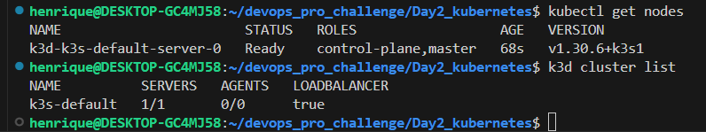

By the way, when we create the cluster with K3d, it also manages the kubectl setup, so the integration is seamless. 

<p align="center">

</p>

Indeed! More importantly, if I inspect the docker situation with `docker container ls`, I'll see the newly created containers being managed by k3d. We can delete them with `k3d cluster delete`.

Let's build a more complex cluster, with increased servers (control planes) and agents (worker nodes):

`k3d cluster create my-cluster --servers 3 --agents 3`

Takes more time, naturally. Kubeclt shows us the current situation:

<p align="center">
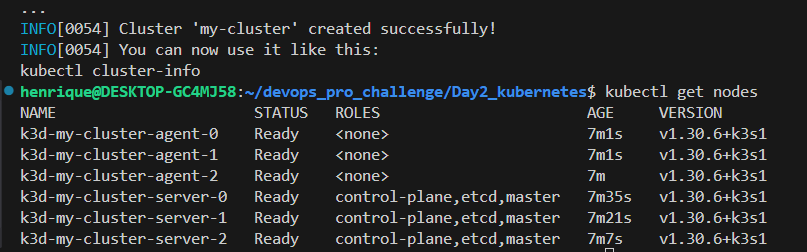
</p>

It is ok to see a control plane acting as a worker in this scenario.

<div align="center">

## $\color{goldenrod}{\textrm{2.3 - Creating an efficient cluster}}$

</div>

A proper cluster will have different interacting agents working together, such as the:

1) pod: the smallest level of the kubernetes cluster, where I run my containers;
2) replica-set: manages the scalability and resiliency of the pods. It's a pod controller.
3) deployment: manages the replica-set for versioning.
4) service: used to expose the pods and the application in the cluster.

The good news is that everything in Kubernetes is created in declarative fashion (just like Docker Compose!) through a .yaml _Manifest_ file.

We need to have the appropriate images readily available if they'll be utilized in this deployment. In this example, we'll use the distance app created previously.

We'll create a 'k8s' folder inside that project with a deployment.yaml file; on that sort of file, we'll almost always need to define 4 components:

- **apiVersion** and **Kind**: every object created in Kubernetes is grouped in API's, so this is explicitly states to avoid conflicts. We can use `kubectl api-resources` to show a list of objects that we can create (pods, deployments, replica-sets, etc), with APIVERSION and KIND fields conveniently placed for us. Since we're creating a deployment, we'll input 'apps/v1' and 'Deployment' in our .yaml file.

<p align="center">
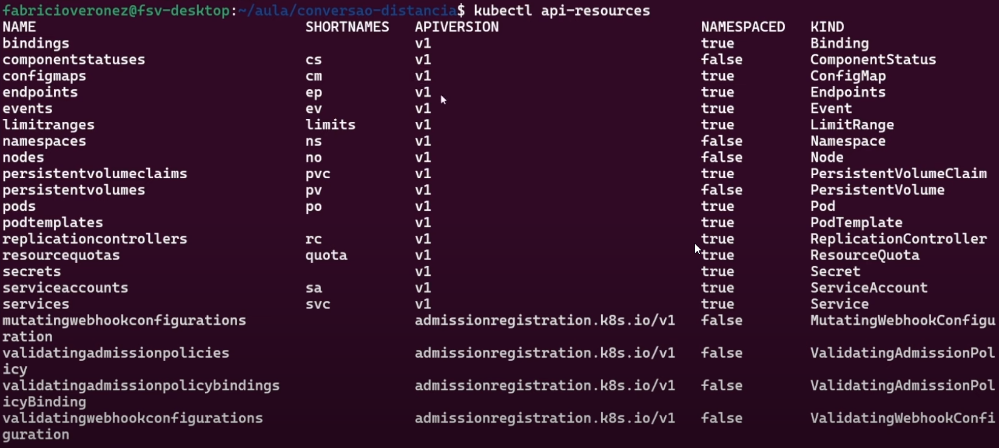
</p>

- **metadata**: name, labels, etc; we'll specify the name 'distance-conversion' for now

- **spec**: info on everything I need to run my application e.g. the pod template. It's particularly important to specify the **selector**, which organizes labels in objects through key-value pairs. "What pods will we work with"? Under the hood, we'll use the replica-set, but more on that later. We also need the **replicas**, **template**, **specs**.

Here's our final result:

```
apiVersion: apps/v1
kind: Deployment
metadata:
  name: distance-conversion
spec:
  replicas: 1
  selector:
    matchLabels:
      app: distance-conversion
    template:
      metadata:
        labels:
          app: distance-conversion
      spec:
        containers:
        - name: distance-conversion
          image: hbatistuzzo/distance-conversion:v1
          ports:
          - containerPort: 5000
```

Now, we can deploy our cluster with 2 methods:

`kubectl create -f k8s/deployment.yaml` or `kubectl apply -f k8s/deployment.yaml`; the first tells kubectl to pull the contents from this file and create the kubernetes objects, and can only be run if there aren't any previous files created; the latter updates the files OR creates them, so.. it's the better choice it seems, other than semantics.

>__WARNING__ remember that you must have initialized the cluster beforehand! (e.g. k3d cluster create my-cluster --servers 3 --agents 3)

Let's verify:

- `kubectl get pods` yields 1 pod, READY 1/1 (1 container running of 1 declared), STATUS running, RESTARTS 0 and AGE 28s; you can assign an option wide to view more details: `kubectl get pods -o wide`

- `kubectl describe pod <name-of-the-pod>` yields a whole world of info about the pod!

- `kubectl get replicaset` yields 1 replicaset, the pod controller, DESIRED 1 (how many replicas I _want_ in my cluster), CURRENT 1 (how many replicas I _have_), READY 1 (how many replicas are _ready_).

- you can list the pod and replicaset levels together with `kubectl get replicaset, pod`. Notice that tha name of the pod is *derived* from the name of the replicaset! When dealing with heavier processes (say, if you have a bunch of replicas), consider using a command such as `kubectl apply -f k8s/deployment.yaml && watch 'kubectl get pods'`: the watch combo lets you monitor the progress in realtime.


<p align="center">
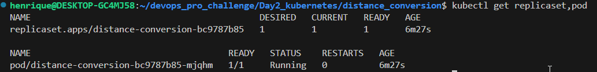
</p>


- `kubeclt get deployment` will show NAME distance_conversion, READY 1/1, UP-TO-DATE 1 and AVAILABLE 1; more on that later.


But how to access the application itself? We need to ensure that any request to the specified port of my local machine will be redirected to the port of the pod running the application (just like Docker's port binding). `kubectl port-forward pod/distance-conversion-bc9787b85-mjqhm 8080:5000`

```
henrique@DESKTOP-GC4MJ58:~/devops_pro_challenge/Day2_kubernetes/distance_conversion$ kubectl port-forward pod/distance-conversion-bc9787b85-mjqhm 8080:5000
Forwarding from 127.0.0.1:8080 -> 5000
Forwarding from [::1]:8080 -> 5000
```

and shazam! Our application will appear in localhost:8080

But this is a pedestrian way to handle the application. We can leverage the power of **service** to establish a single connection point to the pods. It is used every time I want to expose a pod, either internally or externally. It is ubiquitous, and highly customizable.

- "cluster-ip" is a type of service used for internal pod-to-pod connection;
- "node port" is another type of service which exposes the pod to the external world, since it's accessible through any IP that is part of my kubernetes cluster i.e. any machine that is part of my cluster. Every time I use it, it elects a port that will be used as access: by standard, it's a port ranging from 30.000 to 32.777, and you need to check! This is widely used in _on premises_ scenarios. When using Kubernetes _as a service_, through cloud providers, we end up using the service "Load Balancer", but _bear in mind that every service exposes the ports AND perform load balancing_. It just so happends that when using Load Balancer, this is created ahead of my service, so we're not using the IP's of the machines hosted in the kubernetes cluster to access the service. We'll use the IP created for this Load Balancer. More on that later.

Enough chit-chat, have at you! Let's create the service. We need to add an additional object in the deployment.yaml manifest file.

```
---

apiVersion: v1
kind: Service
metadata:
  name: distance-conversion
spec:
  selector:
      app: distance-conversion
  ports:
  - port: 80
    targetPort: 5000
```

pay close attention to this section:

```
    ports:
    - port: 80
    - targetPort: 5000
```

The standard HTTP port for web applications is 80, but I need to make the connection to the port 5000 of the pod who will be running the application.

Rerun the apply and then run `kubectl get all` to list all main objects: pods, services, deployments and replicasets. See, in service, the CLUSTER-IP that I can use (but _SHOULDN'T), a <none> EXTERNAL-IP (since we're not using a Load Balancer) and the 80/TCP port. The Type is 'cluster-ip', which as noted above denotes pod-to-pod connection, an internal way of accessing the applciation.

<p align="center">
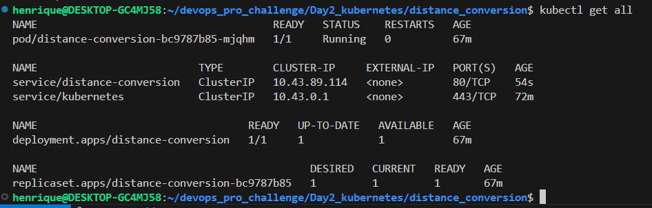
</p>

This is still not what I want. I'd like to access the application externally. But I can't use the Load Balancer because I'm on a local environment (there's no cloud provider connected!). What do? We'll use the **node port**: add the `  type: NodePort` to the end of the manifest and rerun.

<p align="center">
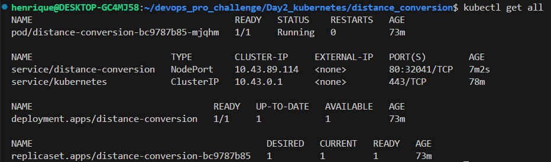
</p>

We now have a 80:30159/TCP port forwarding! So we could access this in the browser by using `<ip-of-the-machine-that-is-running-the-app>:30159`

So we now have this issue: local environment. There's no "machine IP". To fix this we must slightly alter the creation process of the kubernetes cluster. So first of all, destroy the cluster: `k3d cluster delete my-cluster`; recreate with an additional parameter -p (for port publishing/binding! Just like Docker. I'll bind the port of the container to a port in my machine): `k3d cluster create my-cluster --servers 2 --agents 2 -p "8080:30000@loadbalancer"`; we should not use the traditional 80 port in this case for our machine. And we must select one of those node ports from 30000 to 32777; we also specify what container k3d will create to make this binding: loadbalancer.

`kubeclt get nodes` shows everything ok. `docker container ls` shows the binding! 0.0.0.0:8080->30000/tcp. Ok, now rerun the apply and sthen `kubeclt get all` to get our sweet info.

I've created an additional problem now, however. I've published it to 30.000, but when choosing a port in the creation process, NodePort chose port 32569.

<p align="center">
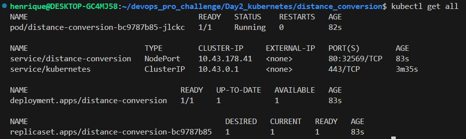
</p>

We must thus specify the nodePort parameter in the manifest file as well, forcing his hand:

```
---

apiVersion: v1
kind: Service
metadata:
  name: distance-conversion
spec:
  selector:
      app: distance-conversion
  ports:
  - port: 80
    targetPort: 5000
    nodePort: 30000
  type: NodePort
```

rerun the apply, and we'll now be able to access the application in localhost:8080

Hot Damn! Also, add more replicas on the manifest. Redeploy, and you'll notice that when refreshing the page, the server that is processing the requistion _changes_: there is a high real availability of my application now, managed with load balancing.

Finally, we can check the updating aspect of the application. Suppose we make a slight change (I've added a "Second version" string to the index.html file). We must now rebuild the image and then re-upload it to the registry, DockerHub, with the v2 tag:

`docker build -t hbatistuzzo/distance-conversion:v2 --push .`

Now alter the manifest so it knows to use the version v2:

```
spec:
  replicas: 8
  selector:
    matchLabels:
      app: distance-conversion
  template:
    metadata:
      labels:
        app: distance-conversion
    spec:
      containers:
      - name: distance-conversion
        image: hbatistuzzo/distance-conversion:v2
        ports:
        - containerPort: 5000
```

and rerun the apply BUT with the watch combo: `kubectl apply -f k8s/deployment.yaml && watch 'kubectl get pod'`. You'll see that it starts destroying the old pods, and creating new ones, but it does so in a way that it _ensures_ there will be NO DOWNTIME for the application. There is always a replica handling the app. Always. But how? Check `kubectl get all`, you'll see that it lists 2 replicasets, one for the older v1 version and one for the newer v2 version. This was managed by the "deployment" component. The deployment section now yields all 8 containers UP-TO-DATE.

I personally think that the best way to monitor this is through ``kubectl apply -f k8s/deployment.yaml && watch 'kubectl get pod,deployment,replicaset'`. If I change the spec in the manifest to draw the v1 version of the image, k3d will perform a rollback. I can see the DESIRED, CURRENT and READY status for the replicasets changing.

<p align="center">
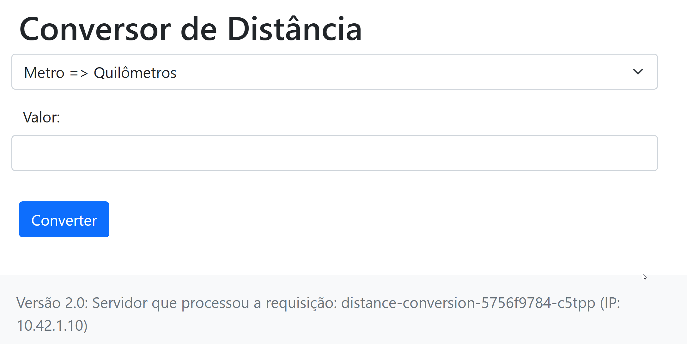
</p>

In reality, I didn't even need to alter the deployment.yaml for the rollback to work, since I can use the handy command `kubectl rollout history deployment distance-conversion` to check the revision history and `kubectl rollout undo deployment distance-conversion && watch 'kubectl get pod'` to watch the rollback happening. The application won't show the "v2 version" in the webpage no more.

---

<div align="center">

# $\color{goldenrod}{\textrm{Day 3 - AWS Cloud}}$

## $\color{goldenrod}{\textrm{3.1 - Intro}}$

</div>

Cloud platforms provide myriad services (such as Storage, Tools/Software availability, Processing capability, Creation platforms) and it's usually more cost-efficient than on-premises solutions, since it subtracts expenses with hardware, internal servers, software licenses, etc, while offering online support.

Amazon's AWS currently dominates this market, followed by Microsoft's Azure, Google's GCP, Oracle CI and Digital Ocean. Such solutions are being widely adopted worldwide as it simplifies scalability and management (by ensuring elasticity of computational resources and decreasing acquisition time), offers service resilience and optimizes application cost since it works on-demand.

I expand further on the advantages and disadvantages of On-Premise, IaaS, PaaS and SaaS models on my cloud_study git repository. This current project will focus on 

We should touch on the concepts of Region and Availability Zone. AWS has service infrastrucuture spread throughout the globe, including one in South America, São Paulo, since 2011. It's expanding rapidly, and the user can choose which of these regions to use (to address latency concerns, for example). The Availability Zone, AZ, regards the Data Centers themselves i.e. the physical, hardware systems. Each region has several interconnected AZ's to ensure resiliency (if one AZ breaks for whatever reason, the others should still be able to handle the load).

<div align="center">

## $\color{goldenrod}{\textrm{3.2 - IAM}}$

</div>

The Identity and Access Manager lets us define users, user groups and roles, as well as assign policies that will control the access level for said users. I'll use these features to detach this present study from my root account; as a rule of thumb, this separation of the root user from specific users/groups/roles is usually a good practice and ensures security. Namely, I'll create, _in this order_:

1) a new user group, `cloud_study`, and assign AdministratorAccess;
2) a new user, `study`, enabling the option for "providing user access to the AWS management console", since I don't want to be confined to the CLI. It'll be an IAM user, and the permissions will be set by adding this user to the `cloud_study` group. I'll add a tag just for organizational purposes. It creates the user, shows us the account_id, allows us to download the info and gives us a link to authenticate. We must log out from our current user to perform this task. Logging into this new user shows us a dashboard with limited access (e.g. no billing info. Which is good. It has adm access. We can also configure standard regions, language, etc)

<div align="center">

## $\color{goldenrod}{\textrm{3.2 - EKS}}$

</div>

For the purpose of this study, we'll create an EKS (Elastic Kubernetes Service) cluster. EKS is neither IaaS nor PaaS, it sits in-between these two as a CaaS (Cluster as a Service):

<p align="center">
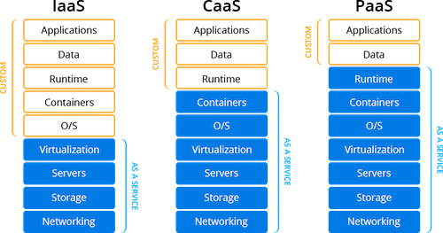
</p>

AWS manages everything up to the Container level. The Runtime, Data and Applications are left for us to manage. This is quite handy, and saves a lot of time. We don't need to define Control Planes, Worker Nodes, etc; we simply declare the version we want to use and specify the node group. There are a few steps:

1) Create the roles and policies for the Kubernetes Cluster and Worker Nodes;
2) Set up the network; this is done with the "Cloud Formation" service from AWS, which (thankfully) is declarative.

<div align="center">

### $\color{goldenrod}{\textrm{3.2.1 - Cluster and Worker Roles}}$

</div>

Back on IAM, let's set up the role for the cluster:

- Roles --> Create role --> AWS service (we're planning on using EKS) --> Use case = EKS --> Service = EKS-Cluster; it suggests using the `AmazonEKSClusterPolicy` in Permission Policies, alright --> Define Role Name ("eks-cluster") and done.

Now the role for the worker nodes:

- Roles --> Create role --> AWS service --> Use case = EC2 --> Service = EC2; this is a more generic service, so now, in Permission Polcies, we must search 3 policies: "AmazonEKSWorkerNodePolicy" (for the Worker Nodes themselves), "AmazonEKS_CNI_Policy (for Container Networking Interfacing) and "AmazonEC2ContainerRegistryReadOnly" (not essential, but allows us to work with Container Registry); --> Define Role Name ("eks-worker") and done.


<div align="center">

### $\color{goldenrod}{\textrm{3.2.2 - Network Setup}}$

</div>

Now we must create the network that will be used by the Kubernetes Cluster. This _can_ get very complex, so we'll use a template instead (a yaml file with declarative code). Let's search "Cloud Formation" on the dashboard. This is a IaC (Infrastructure as Code) feature!

- Stacks --> Create Stack --> Choose an existing template --> Amazon S3 URL --> insert "https://s3.us-west-2.amazonaws.com/amazon-eks/cloudformation/2020-10-29/amazon-eks-vpc-private-subnets.yaml" --> Next --> Stack name = "eks-study-stack", leave the parameters as is (we're creating 2 public and 2 private Subnet Blocks) --> next, review, etc, create!

The template _is_ quite intimidating. It looks like this:

```
---
AWSTemplateFormatVersion: '2010-09-09'
Description: 'Amazon EKS Sample VPC - Private and Public subnets'

Parameters:

  VpcBlock:
    Type: String
    Default: 192.168.0.0/16
    Description: The CIDR range for the VPC. This should be a valid private (RFC 1918) CIDR range.

  PublicSubnet01Block:
    Type: String
    Default: 192.168.0.0/18
    Description: CidrBlock for public subnet 01 within the VPC

  PublicSubnet02Block:
    Type: String
    Default: 192.168.64.0/18
    Description: CidrBlock for public subnet 02 within the VPC

  PrivateSubnet01Block:
    Type: String
    Default: 192.168.128.0/18
    Description: CidrBlock for private subnet 01 within the VPC

  PrivateSubnet02Block:
    Type: String
    Default: 192.168.192.0/18
    Description: CidrBlock for private subnet 02 within the VPC

Metadata:
  AWS::CloudFormation::Interface:
    ParameterGroups:
      -
        Label:
          default: "Worker Network Configuration"
        Parameters:
          - VpcBlock
          - PublicSubnet01Block
          - PublicSubnet02Block
          - PrivateSubnet01Block
          - PrivateSubnet02Block

Resources:
  VPC:
    Type: AWS::EC2::VPC
    Properties:
      CidrBlock:  !Ref VpcBlock
      EnableDnsSupport: true
      EnableDnsHostnames: true
      Tags:
      - Key: Name
        Value: !Sub '${AWS::StackName}-VPC'

  InternetGateway:
    Type: "AWS::EC2::InternetGateway"

  VPCGatewayAttachment:
    Type: "AWS::EC2::VPCGatewayAttachment"
    Properties:
      InternetGatewayId: !Ref InternetGateway
      VpcId: !Ref VPC

  PublicRouteTable:
    Type: AWS::EC2::RouteTable
    Properties:
      VpcId: !Ref VPC
      Tags:
      - Key: Name
        Value: Public Subnets
      - Key: Network
        Value: Public

  PrivateRouteTable01:
    Type: AWS::EC2::RouteTable
    Properties:
      VpcId: !Ref VPC
      Tags:
      - Key: Name
        Value: Private Subnet AZ1
      - Key: Network
        Value: Private01

  PrivateRouteTable02:
    Type: AWS::EC2::RouteTable
    Properties:
      VpcId: !Ref VPC
      Tags:
      - Key: Name
        Value: Private Subnet AZ2
      - Key: Network
        Value: Private02

  PublicRoute:
    DependsOn: VPCGatewayAttachment
    Type: AWS::EC2::Route
    Properties:
      RouteTableId: !Ref PublicRouteTable
      DestinationCidrBlock: 0.0.0.0/0
      GatewayId: !Ref InternetGateway

  PrivateRoute01:
    DependsOn:
    - VPCGatewayAttachment
    - NatGateway01
    Type: AWS::EC2::Route
    Properties:
      RouteTableId: !Ref PrivateRouteTable01
      DestinationCidrBlock: 0.0.0.0/0
      NatGatewayId: !Ref NatGateway01

  PrivateRoute02:
    DependsOn:
    - VPCGatewayAttachment
    - NatGateway02
    Type: AWS::EC2::Route
    Properties:
      RouteTableId: !Ref PrivateRouteTable02
      DestinationCidrBlock: 0.0.0.0/0
      NatGatewayId: !Ref NatGateway02

  NatGateway01:
    DependsOn:
    - NatGatewayEIP1
    - PublicSubnet01
    - VPCGatewayAttachment
    Type: AWS::EC2::NatGateway
    Properties:
      AllocationId: !GetAtt 'NatGatewayEIP1.AllocationId'
      SubnetId: !Ref PublicSubnet01
      Tags:
      - Key: Name
        Value: !Sub '${AWS::StackName}-NatGatewayAZ1'

  NatGateway02:
    DependsOn:
    - NatGatewayEIP2
    - PublicSubnet02
    - VPCGatewayAttachment
    Type: AWS::EC2::NatGateway
    Properties:
      AllocationId: !GetAtt 'NatGatewayEIP2.AllocationId'
      SubnetId: !Ref PublicSubnet02
      Tags:
      - Key: Name
        Value: !Sub '${AWS::StackName}-NatGatewayAZ2'

  NatGatewayEIP1:
    DependsOn:
    - VPCGatewayAttachment
    Type: 'AWS::EC2::EIP'
    Properties:
      Domain: vpc

  NatGatewayEIP2:
    DependsOn:
    - VPCGatewayAttachment
    Type: 'AWS::EC2::EIP'
    Properties:
      Domain: vpc

  PublicSubnet01:
    Type: AWS::EC2::Subnet
    Metadata:
      Comment: Subnet 01
    Properties:
      MapPublicIpOnLaunch: true
      AvailabilityZone:
        Fn::Select:
        - '0'
        - Fn::GetAZs:
            Ref: AWS::Region
      CidrBlock:
        Ref: PublicSubnet01Block
      VpcId:
        Ref: VPC
      Tags:
      - Key: Name
        Value: !Sub "${AWS::StackName}-PublicSubnet01"
      - Key: kubernetes.io/role/elb
        Value: 1

  PublicSubnet02:
    Type: AWS::EC2::Subnet
    Metadata:
      Comment: Subnet 02
    Properties:
      MapPublicIpOnLaunch: true
      AvailabilityZone:
        Fn::Select:
        - '1'
        - Fn::GetAZs:
            Ref: AWS::Region
      CidrBlock:
        Ref: PublicSubnet02Block
      VpcId:
        Ref: VPC
      Tags:
      - Key: Name
        Value: !Sub "${AWS::StackName}-PublicSubnet02"
      - Key: kubernetes.io/role/elb
        Value: 1

  PrivateSubnet01:
    Type: AWS::EC2::Subnet
    Metadata:
      Comment: Subnet 03
    Properties:
      AvailabilityZone:
        Fn::Select:
        - '0'
        - Fn::GetAZs:
            Ref: AWS::Region
      CidrBlock:
        Ref: PrivateSubnet01Block
      VpcId:
        Ref: VPC
      Tags:
      - Key: Name
        Value: !Sub "${AWS::StackName}-PrivateSubnet01"
      - Key: kubernetes.io/role/internal-elb
        Value: 1

  PrivateSubnet02:
    Type: AWS::EC2::Subnet
    Metadata:
      Comment: Private Subnet 02
    Properties:
      AvailabilityZone:
        Fn::Select:
        - '1'
        - Fn::GetAZs:
            Ref: AWS::Region
      CidrBlock:
        Ref: PrivateSubnet02Block
      VpcId:
        Ref: VPC
      Tags:
      - Key: Name
        Value: !Sub "${AWS::StackName}-PrivateSubnet02"
      - Key: kubernetes.io/role/internal-elb
        Value: 1

  PublicSubnet01RouteTableAssociation:
    Type: AWS::EC2::SubnetRouteTableAssociation
    Properties:
      SubnetId: !Ref PublicSubnet01
      RouteTableId: !Ref PublicRouteTable

  PublicSubnet02RouteTableAssociation:
    Type: AWS::EC2::SubnetRouteTableAssociation
    Properties:
      SubnetId: !Ref PublicSubnet02
      RouteTableId: !Ref PublicRouteTable

  PrivateSubnet01RouteTableAssociation:
    Type: AWS::EC2::SubnetRouteTableAssociation
    Properties:
      SubnetId: !Ref PrivateSubnet01
      RouteTableId: !Ref PrivateRouteTable01

  PrivateSubnet02RouteTableAssociation:
    Type: AWS::EC2::SubnetRouteTableAssociation
    Properties:
      SubnetId: !Ref PrivateSubnet02
      RouteTableId: !Ref PrivateRouteTable02

  ControlPlaneSecurityGroup:
    Type: AWS::EC2::SecurityGroup
    Properties:
      GroupDescription: Cluster communication with worker nodes
      VpcId: !Ref VPC

Outputs:

  SubnetIds:
    Description: Subnets IDs in the VPC
    Value: !Join [ ",", [ !Ref PublicSubnet01, !Ref PublicSubnet02, !Ref PrivateSubnet01, !Ref PrivateSubnet02 ] ]

  SecurityGroups:
    Description: Security group for the cluster control plane communication with worker nodes
    Value: !Join [ ",", [ !Ref ControlPlaneSecurityGroup ] ]

  VpcId:
    Description: The VPC Id
    Value: !Ref VPC
```

This process takes a while, so we'll brew some coffee.

<p align="center">
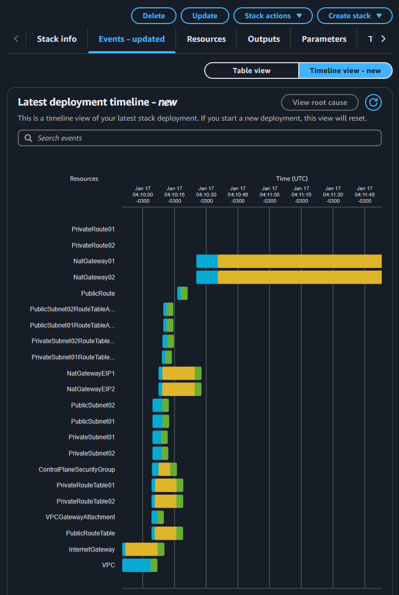
</p>

That took a couple of minutes. But I figure it'll take some days of study to really understand what's going on under the hood. For now, it suffices.

Let's check our progress in the VPC (look it up in the dashboard). Sure enough, the "Your VPCs" menu exhibits the newly created "eks-study-stack-VPC" (it appends -VPC to the end of our input).

Finally, we can create the Kubernetes Cluster itself with EKS.

<div align="center">

### $\color{goldenrod}{\textrm{3.2.3 - Creating the EKS Cluster}}$

>__Warning__ Take a moment to acknowledge the tension in the air. Raise the hair on your neck. Tune in to the web. It's 4 am, the temperature drops and you become more keenly aware of your surroundings. We roll a **Shivers** check, and fail: it enables you to hear the net itself, to truly belong to the web. It is a supra-natural ability; old wrongs play out in present time, scenes across the net happen in front of you. But who is speaking? In the depths of our Inland Empire we hear the faint sound of AWS Virtual Machines ticking in their endless toil, and they will persist long after the world has moved on. We create users, roles, groups, IAMs, VPCs, EKS Clusters knowing full well that **somewhere** one of these godforsaken features is triggering CPU usage in North Virginia, and thus most unfortunately trickling dollars every minute on our billing setting (which is _blocked for view_ for our current IAM user, _as-per-the-good-practices-dictate_). Sure we'd like to rest, but we can't, because there is always that persistent voice ringing in the back of our ancient reptilian brain telling us that we just _might_ have forgotten that one little feature active, and the number on AWS's Cost and Billing Management dashboard will somehow sextuplicate once converted to Brazilian R$, annihilating our meager bank reserves overnight. Thank you, Amazon, for providing your users with such a **thriling** experience. We are, truly, blessed.


<p align="center">

</p>

</div>

Let's head to EKS --> Clusters --> Create Cluster

We'll choose a custom configuration, disabling EKS Auto Mode (which _does_ facilitate the process, but we want to dive into the specifics for didactic purposes).

We name the cluster and associate a Cluster IAM role (the `eks-cluster` role we create above); we can choose the Kubernetes version (1.31 in this case) with standard config.

On the next page, we define the network. We can now choose the `eks-studdy-stack-VPC` created above, instead of the default VPC, as well as the 4 subnets created during that process. We also add the `eks-study-stack-ControlPlaceSecurityGroup` as an additional security group.


On the Cluster endpoint access we define how to access the Kube API Server (the endpoint to communicate with Kubernetes): if private, it'll only work if we're using the AWS network i.e. we won't be able to access it externally, from outside the VPC. If public, everytime the worked nodes need to communicate with the cluster, they'll have to exit AWS's VPC, and access the API Server via internet; The public and private option is the mix that works just right for us.

We review add-ons, additional settings, logging options, etc, and finally create the cluster. This will take 10, 15 minutes..

---

To configure the EKS cluster locally, we need to use the AWS CLI (check the cloud study rep for install instructions). 

Remember to authenticate the user by creating an access key token in IAM --> Users --> security credentials; on the CLI, we must now run `aws eks update-kubeconfig --name <name-of-our-cluster>` in order for EKS to check these credentials

If we run `kubectl get nodes`, it'll show "no resources found"; yes, we've created the cluster. We have the Control Plane, but we still don't have any worker nodes to run the pods. We do that at AWS in EKS --> Clusters --> Compute tab, and add a node group!

The node group defines the computational profile that we'll use in our cluster. Let's name it "study-default" and add the `eks-worker` IAM role. The next page will show our profile: we'll use Amazon Linux machines with On-Demand capacity, and t3.medium instance with 20 GiB. We can also define the scaling configuration: let's use 2-2-2. We must now define in which subnets we will deploy our EC2 nodes; usually it's a good custom to deploy them in the private subnets. Review, and create. It takes 5 to 10 min.

Now, `kubectl get nodes` will exhibit the "ip-xxx-xxx-xxx-xxx.ec2.internal" nodes, who are ready to be utilized. Everything is ready to receive the deploy of our application!

---

KubeDev's Fake-Shop application can be found in the src folder together with a README file. It's developed in python with similar technologies to the distance-conversion project we deployed on Day2 (flask, g-unicorn, etc); it encompasses a PostgreSQL database managed through SQLAlchemy. It has a Dockerfile ready to build the image and a shell entrypoint that will secure the database creation and the webpage deploy.

We build the image with `docker build -t hbatistuzzo/fake-shop:v1 --push .`. Now we can deploy the application on Kubernetes; once again, we must create the manifest .yaml file. Let's synthesize the information so far: our e-commerce is a web application which interfaces with a postgres DB, thus we need to set the DB _and_ and the web app. Hence we need _TWO_ deploys, with _TWO_ services. It's important to note that the webapp needs to be exposed to the "exterior", but not the DB. We'll add a "k8s" folder to host the manifest.

Let's start with the PostgreSQL DB:

```
apiVersion: apps/v1
kind: Deployment
metadata:
  name: postgre
spec:
  selector:
    matchLabels:
      app: postgre
  template:
    metadata:
      labels:
        app: postgre
    spec:
      containers:
        - name: postgre
          image: postgres:13.16
          ports:
            - containerPort: 5432
          env:
            - name: POSTGRES_DB
              value: fakeshop
            - name: POSTGRES_USER
              value: fakeshop
            - name: POSTGRES_PASSWORD
              value: Pg1234
---
apiVersion: v1
kind: Service
metadata:
  name: postgre
spec:
  selector:
    app: postgre
  ports:
    - port: 5432
      targetPort: 5432
```

Let's deploy! `kubectl apply -f k8s/deployment.yaml`

`kubectl get pod` shows 1 pod running. `kubectl get all` shows our 2 services, the deployment and the replicaset. Great!

We must now deploy the web application. We configure it in the same deployment.yaml file:

```
# postgre manifest code etc etc
---
# deployment of web application
apiVersion: apps/v1
kind: Deployment
metadata:
  name: fakeshop
spec:
  replicas: 1
  selector:
    matchLabels:
      app: fakeshop
  template:   # Moved out from under selector
    metadata:
      labels:
        app: fakeshop
    spec:
      containers:
        - name: fakeshop
          image: hbatistuzzo/fake-shop
          ports:
            - containerPort: 5000
          env:
            - name: DB_HOST
              value: postgre
            - name: DB_USER
              value: fakeshop
            - name: DB_PASSWORD
              value: Pg1234
            - name: DB_NAME
              value: fakeshop
            - name: FLASK_APP
              value: index.py
---
apiVersion: v1
kind: Service
metadata:
  name: fakeshop
spec:
  selector:
    app: fakeshop  # Added missing space
  ports:
    - port: 80
      targetPort: 5000
  type: LoadBalancer
```

Let's deploy again! `kubectl apply -f k8s/deployment.yaml`

`kubectl get pod` shows 2 pods running. Great!

`kubectl get service` yields an external IP for us to access our application, provided by AWS. Whoa it actually works.

If I were to delete this pod with `kubectl delete pod fakeshop-etc` (get the actual name with `kubectl get pod`), there would be a little bit of downtime since I've only specified 1 replica, so the cluster must configure a new one from scratch.

We can increase the number of replicas on the manifest file (say.. 4). We apply again, and now if I delete a pod, the service consistently stays up without any downtime, since there is a pod ready to jump in and take the deleted one's place. No downtime. Flabbergasting.

The same happens if I decide to alter the application itself (e.g. the index.html), rebuild the image, push it to DockerHub as a "v2" and redeploy with `kubectl apply etc`. The web application will be redeployed asap, but there will never be any downtime. The v1 will stay up until the cluster is 100% ready to deploy the v2.

This is, in theory, one of the most efficient ways to deploy an application nowadays.

>__WARNING__ REMEMBER TO DESTROY THE CLUSTER, LEST AMAZON SUCKS YOUR BANK ACCOUNT DRY


